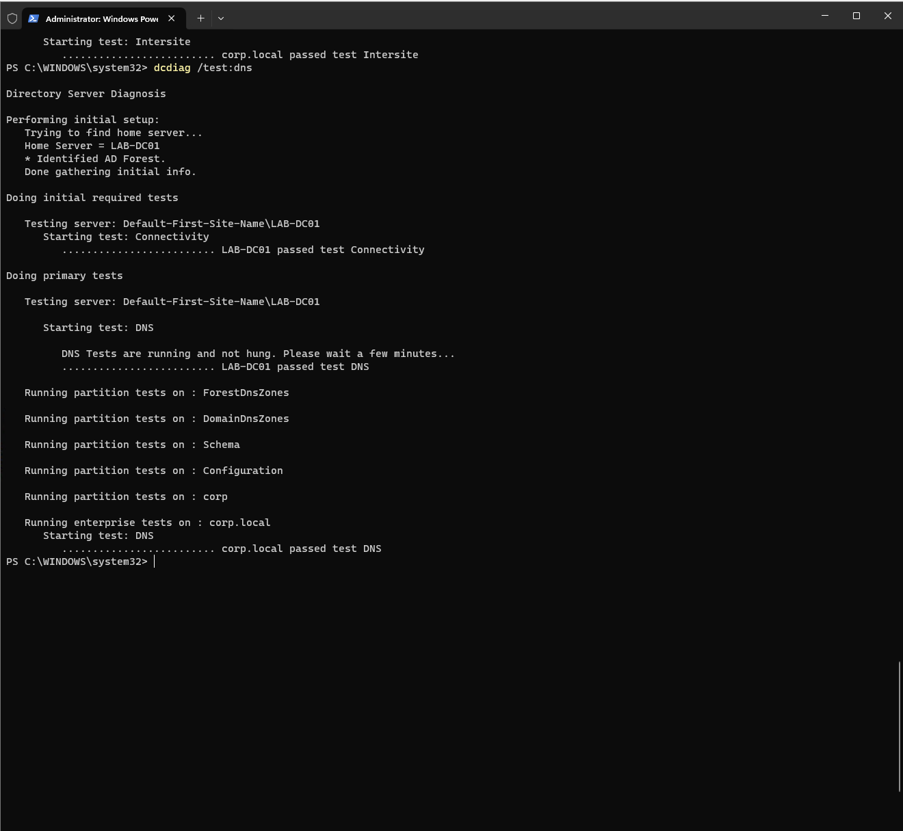

# Active Directory Help Desk Lab

This is a Windows Active Directory home lab consisting of user admin, Group Policy, DNS, file-share permissions, PowerShell, and general help-desk troubleshooting.

## Project Overview

This lab simulates a small business Windows domain using Windows Server 2025 and Windows 11 virtual machines running in Hyper-V.

I used the lab to practice Active Directory administration, user onboarding and offboarding, password and account lockout troubleshooting, security group management, shared-folder permissions, Group Policy, DNS troubleshooting, and basic PowerShell administration.

The lab also gave me a chance to troubleshoot some real issues during the setup, particularly with Active Directory and DNS.

## Lab Environment

- Windows Server 2025 Domain Controller
- Windows 11 Domain-Joined Workstation
- Hyper-V
- Active Directory Domain Services
- DNS
- Group Policy
- PowerShell
- SMB file sharing
- Domain: `corp.local`

[More details about the lab environment](documentation/environment.md)

## Help Desk Scenarios

I worked through five simulated help-desk scenarios:

- **INC-001:** User password reset
- **INC-002:** Account lockout
- **INC-003:** Shared-folder access
- **SR-004:** New employee onboarding
- **SR-005:** Employee offboarding

[View the help-desk scenarios](documentation/helpdesk-scenarios.md)

## Group Policy and PowerShell

I created a workstation Group Policy, verified that it was being applied, and then intentionally created a GPO scope problem to practice diagnosing why a policy wasn't reaching a workstation.

I also used PowerShell to query and manage Active Directory users, groups, group memberships, and OUs.

[View the administration work](documentation/administration.md)

## DNS Troubleshooting

The initial Active Directory setup ran into DNS problems. I used tools including `dcdiag`, `nslookup`, PowerShell, DNS Manager, and Event Viewer while troubleshooting the environment.

After rebuilding the domain and correcting the DNS configuration, I used `dcdiag /test:dns` to verify that the domain controller and domain were passing their DNS tests.

[View the DNS troubleshooting process](documentation/troubleshooting.md)

## Skills Demonstrated

- Active Directory user and group admin
- User onboarding and offboarding
- Password resets and account lockout troubleshooting
- Group-based access
- Share and NTFS permissions
- Group Policy configuration and troubleshooting
- PowerShell admin
- Windows domain troubleshooting
- DNS troubleshooting
