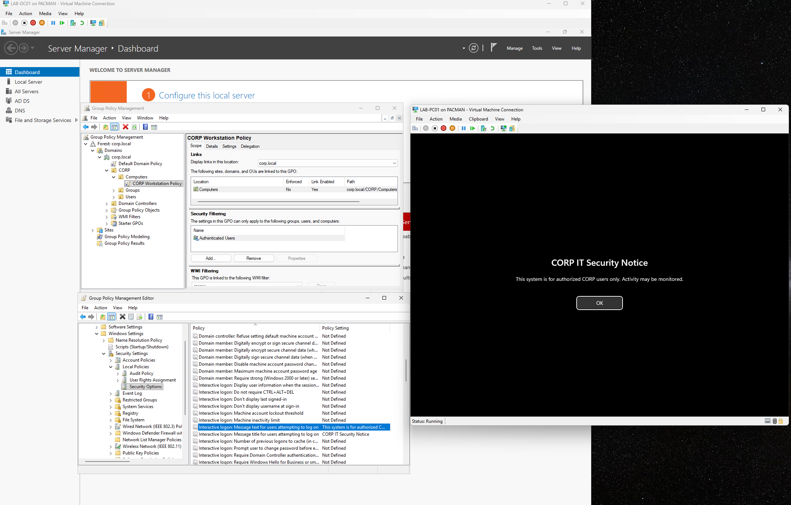
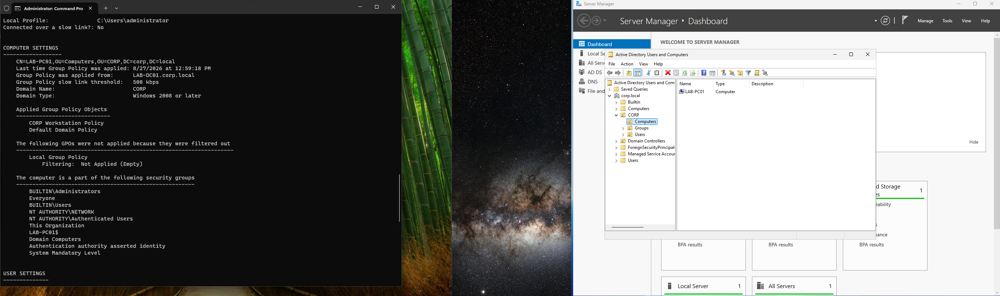
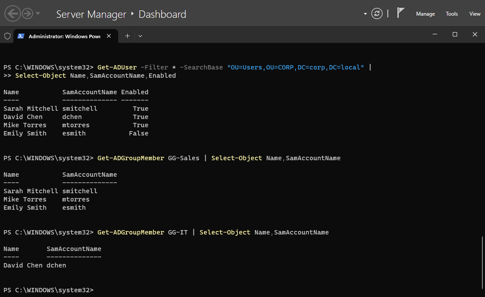

# Active Directory Administration

In addition to the help-desk scenarios, I used the lab to practice Group Policy management, troubleshooting, and basic Active Directory administration with PowerShell.

## Group Policy

I created a Group Policy Object named `CORP Workstation Policy` and linked it to the `CORP\Computers` OU.

The policy configured an interactive logon security notice for domain workstations.

After creating the policy, I ran:

`gpupdate /force`

on `LAB-PC01` and verified that the security notice appeared at logon.

I also used `gpresult /r` to verify that `CORP Workstation Policy` was being applied to the workstation.

## Group Policy Troubleshooting

To practice troubleshooting, I intentionally moved `LAB-PC01` from the custom `CORP\Computers` OU back into the domain's default `Computers` container.

After refreshing Group Policy, `gpresult /r` showed that `CORP Workstation Policy` was no longer being applied.

I checked where the GPO was linked in Group Policy Management and compared it with the location of the computer object in Active Directory. This showed that `LAB-PC01` was outside the scope of the policy.

I moved the computer back into `CORP\Computers`, refreshed Group Policy, and used `gpresult /r` to confirm that the policy was applied again.

**Takeaway:**  
A correctly configured GPO will not apply if the target object is outside the scope of where the policy is linked. Checking both the GPO link and the location of the AD object is an important part of Group Policy troubleshooting.

---

## PowerShell Administration

I also practiced using the Active Directory PowerShell module to retrieve and manage directory information.

Examples included:

- Querying user account properties with `Get-ADUser`
- Checking security group membership with `Get-ADPrincipalGroupMembership`
- Listing group members with `Get-ADGroupMember`
- Querying organizational units with `Get-ADOrganizationalUnit`
- Searching for users within a specific OU
- Creating a disabled test account with `New-ADUser`
- Removing the test account with `Remove-ADUser`

Using PowerShell provided another way to inspect and administer Active Directory without relying entirely on graphical management tools.
