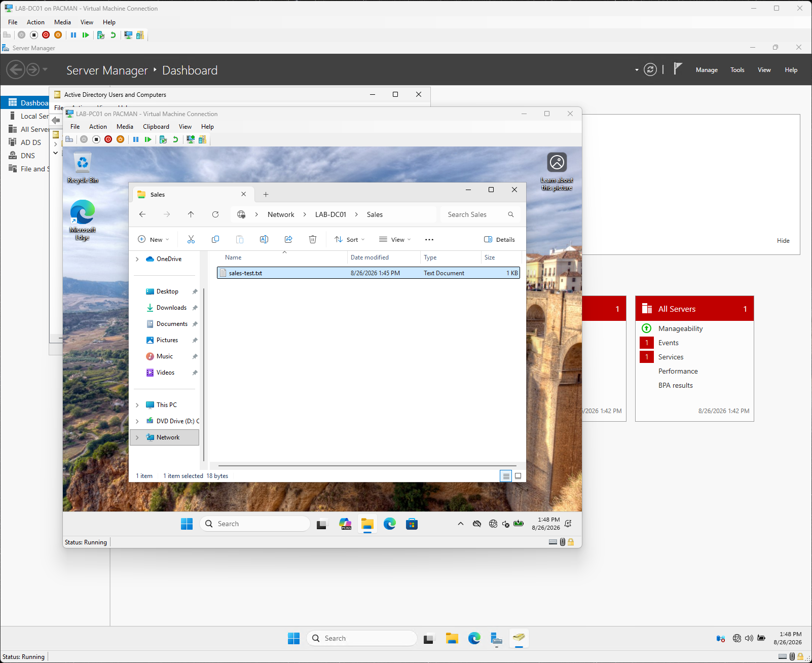
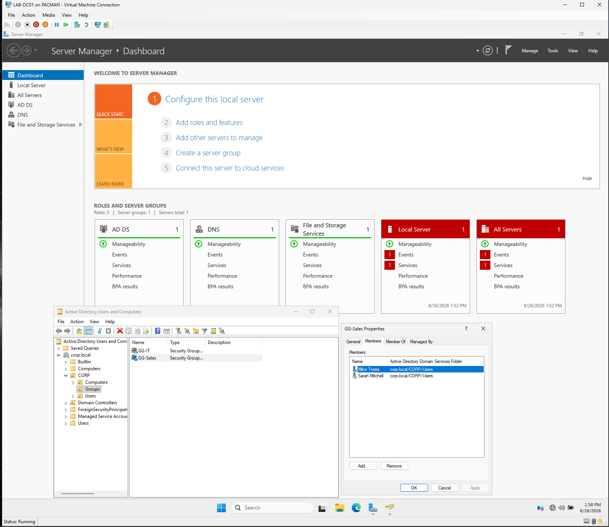
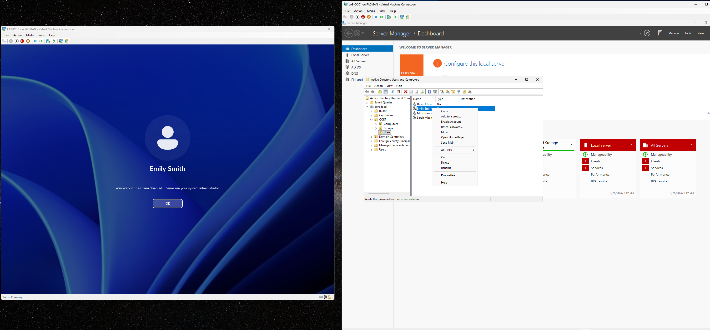

# Help Desk Scenarios

In this lab, I simulated several support tickets to practice some of the common tasks performed by IT support/help desk technicians.

## INC-001: User Password Reset

**Issue:**
A user was unable to access their account and required a password reset.

**Resolution:**
- I reviewed the user's account in Active Directory Users and Computers
- Verified the account before making changes
- Reset user's password to a temporary password
- Required user to change their password at next login
- Verified successful authentication from the admin workstation

**Takeaway:**
Password resets should always include verification of the account state and should allow the user to establish a private, permanent password

---

## INC-002: Account Lockout

**Issue:**
A user became locked out of their domain account after repeated failed login attempts.

**Resolution:**
- I reviewed the domain password and account lockout policy
- Configured an account lockout trigger of five failed attempts
- Reproduced the issue by generating failed login attempts
- Found the locked account in Active Directory
- Unlocked the account without unnecessarily resetting the user's password
- Verified successful authentication

**Takeaway:**
An account lockout and a forgotten password are different problems. Identifying the actual account state prevents unnecessary password changes.

---

## INC-003: Shared Folder Access

**Issue:**
Sales users required access to a department network share

**Resolution:**
- Created an SMB share at \\LAB-DC01\Sales
- Assigned access through the GG-Sales security group, rather than individual users
- Configured share permissions with change access
- Configured NTFS permissions with mofify access
- Verified that an authorized Sales user could access the shared folder and create files

###Access Troubleshooting
To simulate a permissions issue, a Sales user was removed from group GG-Sales
The user could no longer access the share. I compared the affected user's group membership with a working Sales user, identified the missing GG-Sales membership, restored it, and verified access after the user's authentication session as refreshed

**Takeaway:**
Using security groups for resource permissions simplifies both access management and troubleshooting. Group membership changes may also require a new user logon session before the updated access token takes effect.

---

## SR-004: New Employee Onboarding

**Request:**
Create an account for a new Sales employee and provide access to dept resources.

**Resolution:**
- Created the new domain user in the appropriate organizational unit
- Assigned a temp password and required a password change at first login
- Added the employee to GG-Sales group
- Verified successful domain authentication
- Verified access to the Sales network share without modifying folder permissions

**Takeaway:**
Group-based access control makes onboarding more consistent and especially scalable because the permissions do not need to be configured separately for each employee.

---

## SR-005: Employee Offboarding

**Request:**
Remove Domain access for a departing employee.

**Resolution:**
- Disabled the employee's Active Directory account rather than immediately deleting it
- Verified that future domain authentication was blocked
- Tested the behavior of the employee's already-authenticated workstation session
- Observed that disabling the AD account did not automatically terminate an existing Windows session
- Signed the existing session out to complete containment

**Takeaway:**
This was an interesting one because I noticed that disabling an Active Directory account does prevent future authentication but does not necessarily terminate sessions that have already been authenticated.
Offboarding procedures should account for active sessions in addition to disabling the identity.

